# BlissBoost

By Melody Lisa.

[View the live project here.](https://blissboost-079490cc3274.herokuapp.com)

This is the documentation for BlissBoost - a social media site aimed towards spreading positivity in all aspects of life. The site has been built using HTML5, CSS3 with materialize templating, MongoDB and Python with Jinja templating for the Milestone 3 backend development project for Code Institute's web development diploma.

******

## Contents

* [User Experience (UX)](#user-experience---ux)
  * [Strategy](#strategy)
    * [User Goals](#user-goals)
    * [Site Owner Goals](#site-owner-goals)
    * [User Stories](#user-stories)
  * [Scope](#scope)
  * [Structure](#structure)
  * [Skeleton](#skeleton)
* [User Interface (UI) Design](#user-interface---design)
  * [Typography](#typography)
  * [Colours](#colours)
* [Features](#features)
    * [Header](#header)
    * [Main](#main)
    * [Modals](#modals)
    * [Footer](#footer)
    * [404 Page](#404-page)
* [Future Implementations](#future-implementations)
* [Accessibility](#accessibility)
  * [Alt Text](#alt-text)
  * [Aria Labels](#aria-labels)
  * [Colours](#colours-1)
  * [Fonts](#fonts)
* [Technologies Used](#technologies-used)
  * [Languages](#languages)
  * [Frameworks, Libraries, and Programs Used](#frameworks-libraries-and-programs-used)
* [Deployment & Local Development](#deployment--local-development)
  * [Deployment](#deployment)
  * [Local Development](#local-development)
    * [How to Fork](#how-to-fork)
    * [How to Clone](#how-to-clone)
* [Testing](#testing)
* [Credits](#credits)
  * [Code Used](#code-used)
  * [Content](#content)
  * [Media](#media)
  * [Achnowledgements](#acknowledgements)
 

[*Back to top*](#contents)

-----

## User Experience - UX

### Strategy

This project was built as a milestone project on my Diploma in Web Application Development with [Code Institute](https://codeinstitute.net/) as a learning tool for interactive frontend development and my first project using Python and Flask and so there was no specific client. However, in order to create a more professional product I treated it as a real-world application inspired by social media. The aim was to create a site that spreads positive and uplifting messages that users can like and look back on when they want a boost. 

#### User Goals

- Create an account on the site.
- Add personal details and information onto a personal profile.
- View and create posts on the community page.
- Edit or delete personal posts.
- Like posts from the community page to view on their profile.
- Delete personal account when no longer in use.

#### Site Admin Goals

In addition to user goals:

- Edit or delete any post from the community page.
- Add, edit or delete post themes from the theme management page.

#### User Stories

- I want to be able to create my profile and edit it to my liking.
- I want to view all posts created on the site and like my favourite ones.
- I want to be able to see my liked posts in one place on my profile to read later.

[*Back to top*](#contents)

-----

### Scope

Taking all of the above into account I decided I would need 5 main pages that users can navigate to from the navbar plus 3 pages for adding and editing information:

- __Home Page:__ When users first navigate to the site they are taken to the index.html page, this provides information to the user about the purpose of the site and it's core values. There is a call to action here for users to register an account or log in. Once a user is logged in, they are redirected to their profile as the "home" instead.

- __Register__: Here users can create their account. This is a simple form that asks them to create a username and password, with an extra password field for validation. Users can hide or unhide their password input for accessibility.

- __Log In:__ Here users who already have an account can log in to view their profile and the community page. They are prompted to enter their username and password. Users can hide or unhide their password input for accessibility.

- __Profile Page:__ Here users can upload a photo url via the upload modal and delete their profile, as well as view posts that they have liked from the community page. In this current version of the site the user is the only person who can view their profile.

    - __Edit Profile:__: From the user's profile page they can also click a link to edit profile information. Here they can add their name, date of birth and write some information about themselves.

- __Community Posts:__ Here the users can view posts made by anyone on the site, search for posts based on theme or username, like posts to be saved to their profile, use the floating action button to navigate to create their own posts, and navigate to edit posts using the edit button that appears only if they have created the post.

    - __Add Post:__ Using the floating action button, users navigate to the add post page. Here they can write a title, choose a theme, and write a post description. Themes come with their own custom image that shows up when the post is created.

    - __Edit Post__: When viewing your own post, an edit button appears in the top corner of the post card. Here users can navigate to the edit post page. This is similar to the add post page, with current post information stored within the input fields.

As well as these main pages, Admin can access 3 additional pages as well as edit any post on the site.

- __Manage Themes:__ Here admin can view all themes that users can post under as well as a preview of the theme images that appear within posts. They can navigate to add, edit, and delete themes. The delete theme button opens a modal to confirm deletion.

    - __Add Theme:__ This takes admin to a simple form where they can input the theme name and upload an image url for the new theme.

    - __Edit Theme:__ This takes admin to a form similar to add theme, but the information for the current theme is available in the input fields.

[*Back to top*](#contents)

-----

### Structure

#### Site Structure

The navigation bar for the site will take users to all main sections of the site with some non-navigation links implemented for adding or editing content. Content deletion is implemented using modals for confirmation. The navbar brand logo will take logged out users to the home page and logged in users to their profile page.

|**Navbar?**| **Logged Out** | **Logged In (non-admin)** | **Logged In (admin)** |
| ----------| -------------- | ------------------------- | --------------------- |
| Yes       | Home           | ----                      | ----                  |
| Yes       | ---            | Community                 | Community             |
| No        | ---            | Add Post                  | Add Post              |
| No        | ---            | Edit Post (created_by)    | Edit Post (Any)       |
| Yes       | ---            | Profile                   | Profile               |
| No        | ---            | Edit Profile              | Edit Profile          |
| Yes       | Register       | ---                       | ---                   |
| Yes       | Sign In        | ---                       | ---                   |
| Yes       | ---            | Sign Out                  | Sign Out              |
| Yes       | ---            | -------                   | Manage Themes         |
| No        | ---            | -------                   | Add Theme             |
| No        | ---            | -------                   | Edit Theme            |

Logged Out Navbar

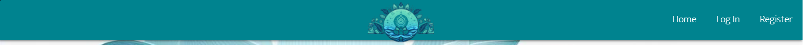

Logged In Navbar

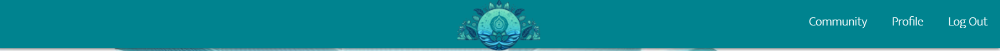

Admin Navbar

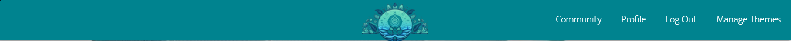

[*Back to top*](#contents)

-----

### Skeleton

#### Wireframes

All wireframes have been created with [Figma](https://figma.com/).

BlissBoost Home Wireframes

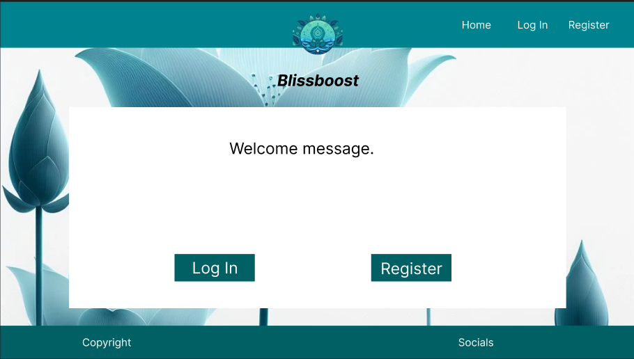
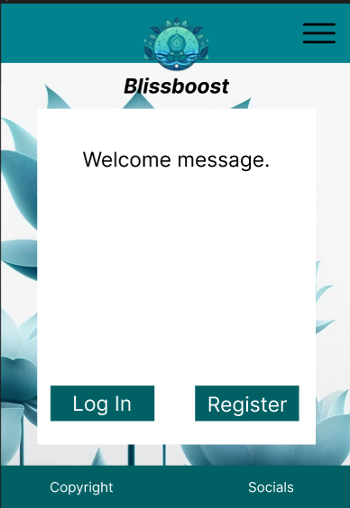
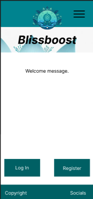

BlissBoost Register Wireframes

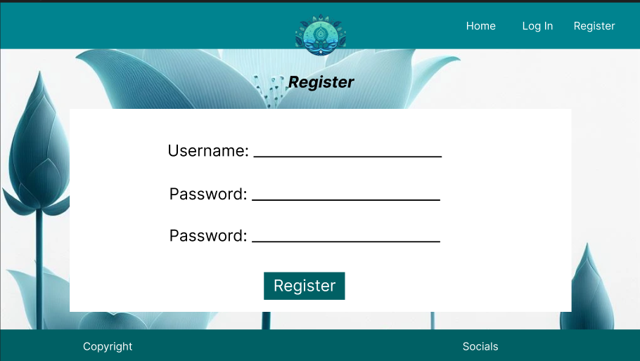

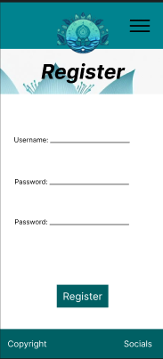

BlissBoost Login Wireframes

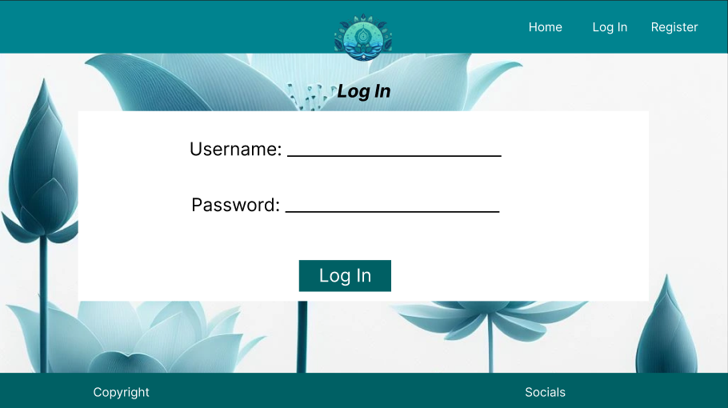
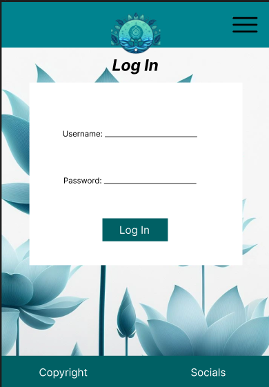
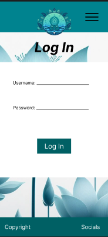

BlissBoost Profile Wireframes

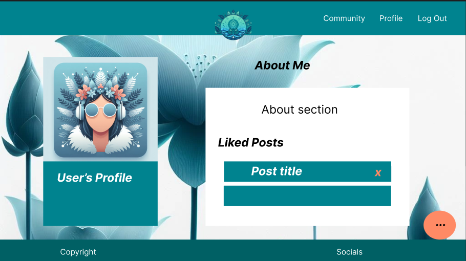
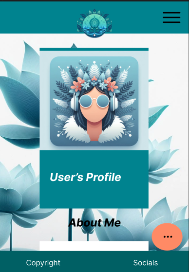

BlissBoost Community Posts Wireframes

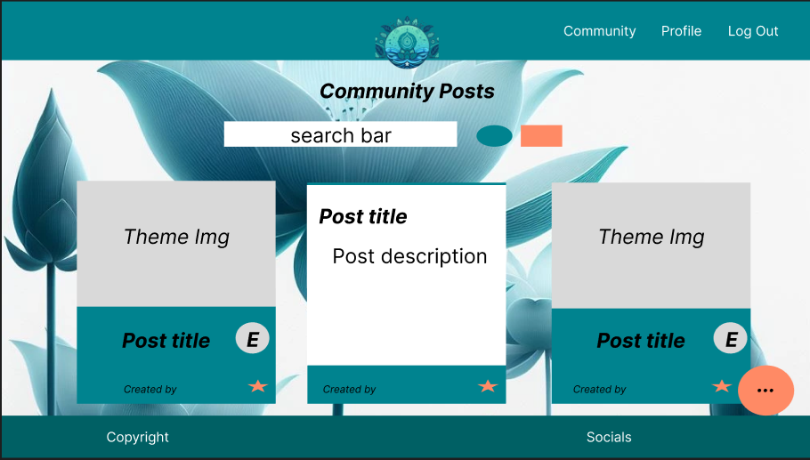
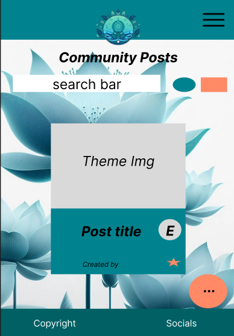
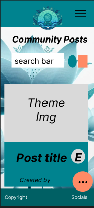

BlissBoost Edit Profile Wireframes

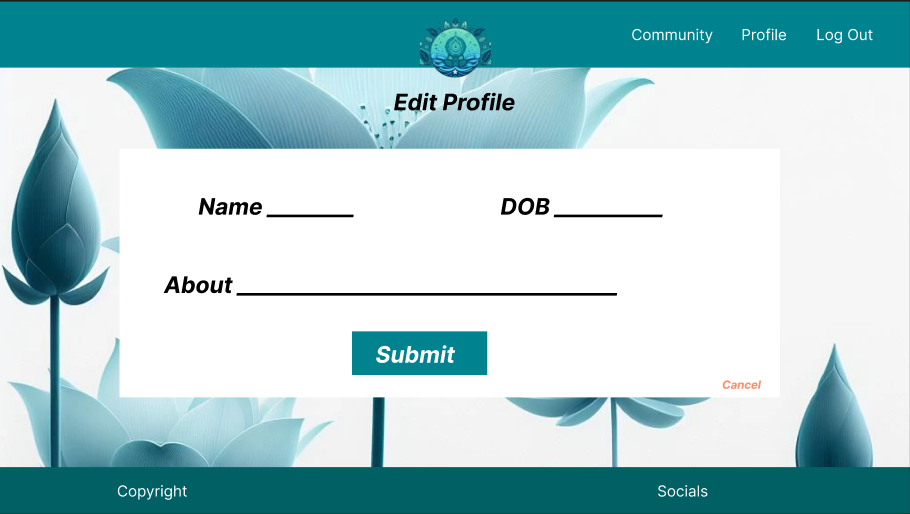
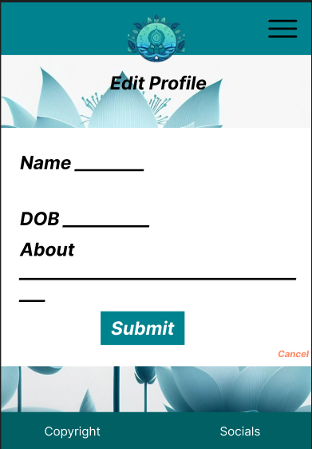
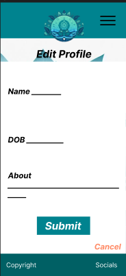

BlissBoost Add and Edit Posts Wireframes

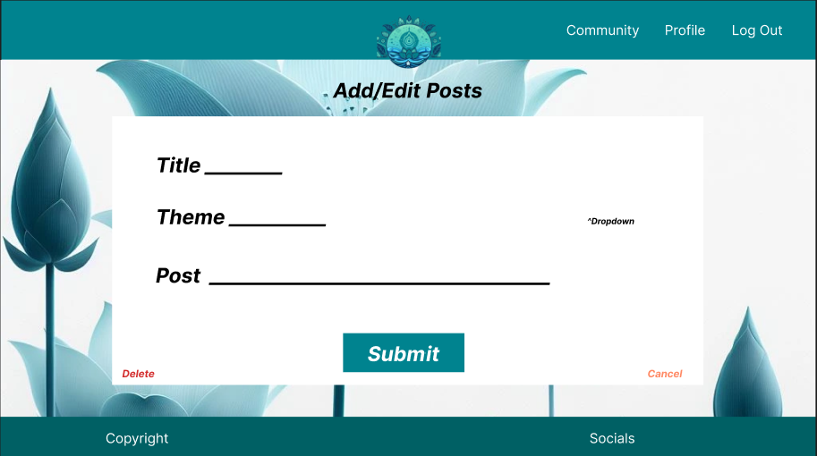
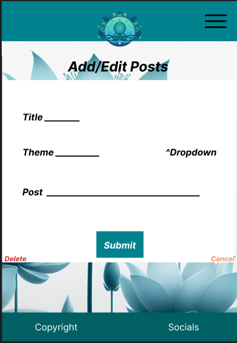
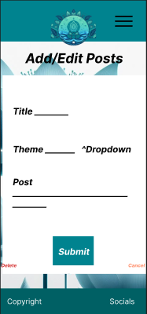
The add and edit post pages will be almost identical, with just the addition of "Delete" link in edit post page.

BlissBoost Manage Themes Wireframes

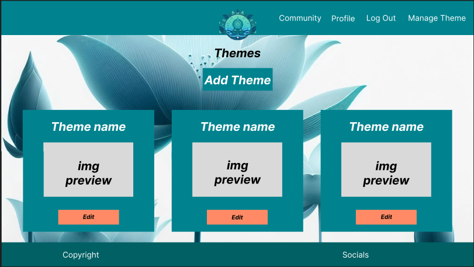
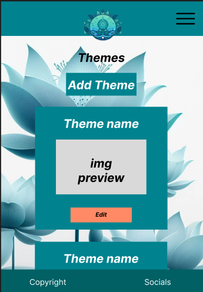
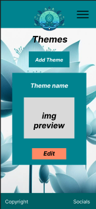

BlissBoost Add Theme Wireframes

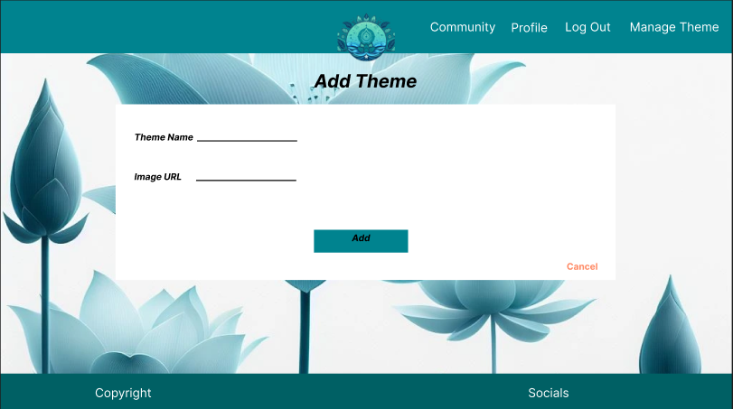
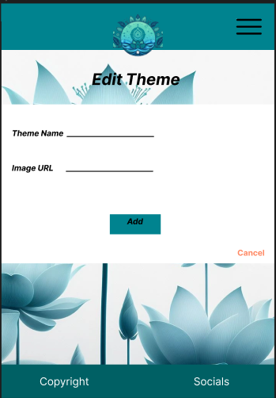
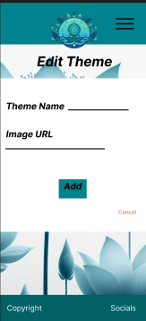

BlissBoost Edit Theme Wireframes

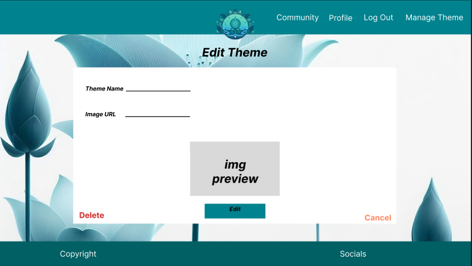
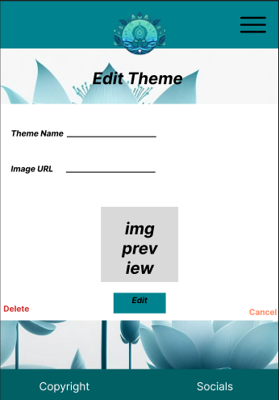
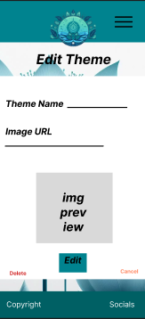

[*Back to top*](#contents)

-----

## User Interface - Design

### Surface

#### Typography

Fonts have been imported from [Google Fonts](https://fonts.google.com/).

#### Colours

The colour scheme for the site was kept simple and chosen through materialize color picker to keep styling as seamless and easy as possible.

Main colour scheme for the site

Colour scheme images made with [figma](https://figma.com).

[*Back to top*](#contents)

-------

## Features

### Favicon

Favicon

The favicon for the site #. The favicon was created using [favicon.io](https://favicon.io/).

### Header

Navbar

The navigation bar at the top of each page features the brand logo along with different links depending on whether you are signed in or not.

For users not logged in to the site, the home, sign in and register pages are available. Once a user logs in to the site they have access to their personal profile and the community page where they can view posts that have been made to the site.

Header

### Footer

Footer

The footer contains the copyright information and social media links. The social media links open in a new tab.

### Home

### Register

### Log In

### Profile

### Community

### 404 Page

404 Page

The 404 page is a custom page that redirects the user to the main page if they type in an incorrect url.

[*Back to top*](#contents)

------

## Future Implementations

[*Back to top*](#contents)

-----

## Accessibility

### Alt Text

Alternative text has been included for all images across the site.

### Aria Labels

Aria labels have been included for all links across the site with modals labelled by their headings.

### Colours

The colours across the site have been kept simple with 

### Fonts

[*Back to top*](#contents)

-------

## Technologies Used

### Languages

- HTML
- CSS - with materialize templating
- Python - with jinja templating

### Frameworks, Libraries, and Programs Used

* [MongoDB](https://www.mongodb.com) - The database used for storing information for the site.

* [Heroku](https://www.heroku.com) - For website deployment.

* [Materialize v1.0.0](https://materializecss.com) - The framework for the website. Additional CSS styling was also implemented in style.css.

* [favicon](https://favicon.io/) - To create the favicon for the site.

* [Figma](https://figma.com/) - For wireframes and other graphics in readme.

* [Font Awesome](https://fontawesome.com/) - For the iconography on the website.

* Git - For version control.

* [Github](https://github.com/) - To save and store the files for the website.

* Google Dev Tools - To troubleshoot and test features, solve issues with responsiveness and styling.

* [JS Hint](https://jshint.com/) - To check the javascript code for errors.

* [Google Fonts](https://fonts.google.com/) - To import the fonts used on the website.

* [Bing Create](https://www.bing.com/images/create) - For background image and logo generation.

* [Red Ketchup](https://redketchup.io/image-resizer) - To convert background image to webp format.

* Samsung Talkback - To test accessibility.

* [UI.dev](https://ui.dev/amiresponsive) - To show the site on a range of screen sizes.

* [W3C Markup Validation Service](https://validator.w3.org/) - To validate HTML and CSS code.

[*Back to top*](#contents)

-------

## Deployment & Local Development

### Deployment

[*Back to top*](#contents)

-----

## Testing

Please see [testing.md](testing.md) for all testing elements of this site.

[*Back to top*](#contents)

-----

## Credits

### Code Used

* [Materialize](https://materializecss.com): Code from this page was used and adapted to create various features across the site, including the navbar, footer, cards for different sections of pages and floating action buttons.

* [Mini Tales](https://github.com/adampgiles/CI_PP3_MT): Code from this CI project used to create the like buttons functionality.

* [W3Schools](https://www.w3schools.com/howto/howto_js_toggle_password.asp): Code used to show/hide password inputs from here.

### Content

* [Melody Lisa](https://github.com/Melody-Lisa): All other content created by the developer.

### Media

* [Bing Create](https://www.bing.com/images/create): This image generator was used to create the site's logo and background image.

* [UI.dev](https://ui.dev/amiresponsive): Used to generate images that showcase the responsive design within the readme file.

### Acknowledgements

* Amy Richardson - Cohort Facilitator: For providing great resources to help with everyone's projects through weekly stand ups.
 
* Class June 2023: Everyone in my class channel on slack who is involved with the stand ups and group chat for contributing to the great atmosphere and supportive environment.
 
* The wider slack community: For quick responses to various issues and questions I had at all stages of the project.
 
* Friends and Family: For helping me to test my site on various devices and provide feedback.

[*Back to top*](#contents)