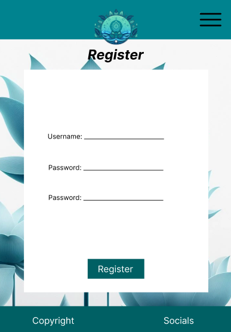
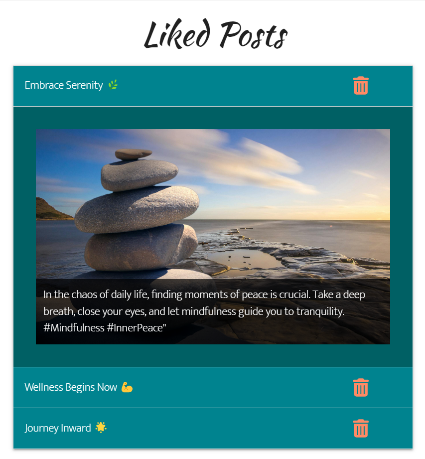
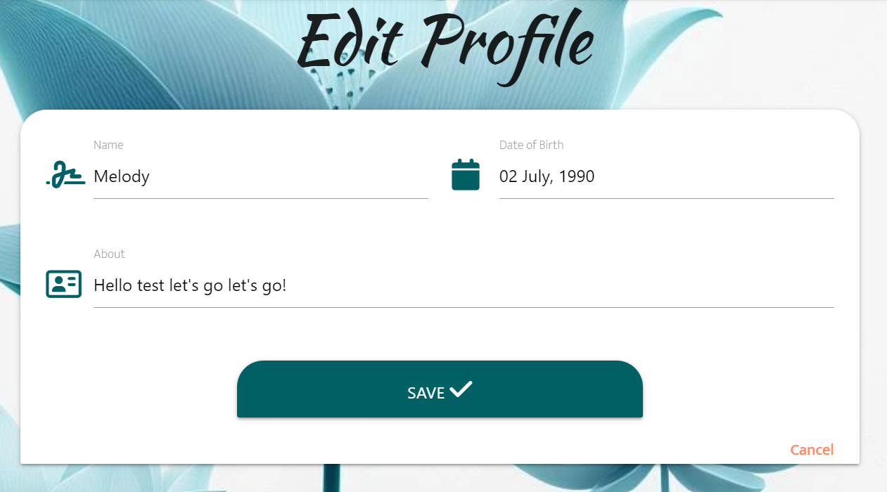
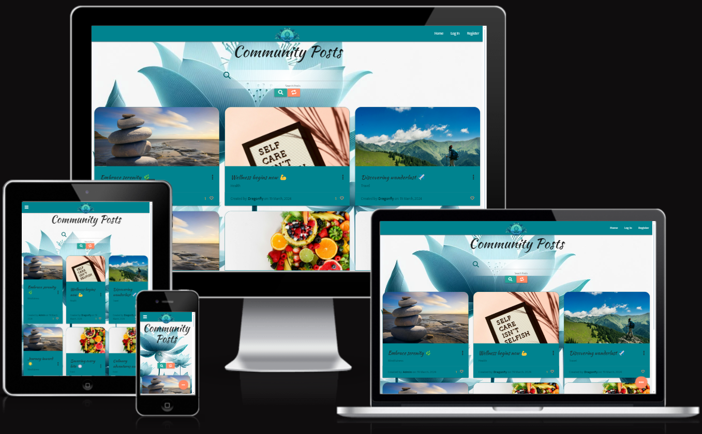
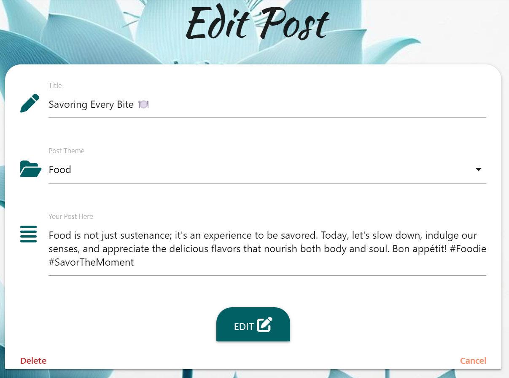
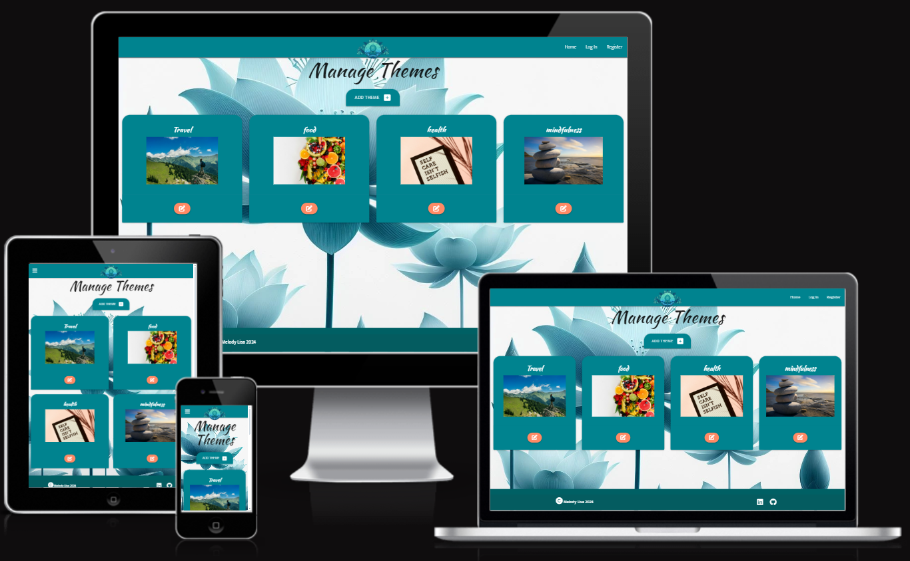

# BlissBoost

By Melody Lisa.

[View the live project here.](https://blissboost-079490cc3274.herokuapp.com)

This is the documentation for BlissBoost - a social media site aimed towards spreading positivity in all aspects of life. The site has been built using HTML5, CSS3 with materialize templating, MongoDB and Python with Jinja templating for the Milestone 3 backend development project for Code Institute's web development diploma.

******

## Contents

* [User Experience (UX)](#user-experience---ux)
  * [Strategy](#strategy)
    * [User Goals](#user-goals)
    * [Site Admin Goals](#site-admin-goals)
    * [User Stories](#user-stories)
  * [Scope](#scope)
  * [Structure](#structure)
    * [Site Structure](#site-structure)
    * [Database Structure](#database-structure)
  * [Skeleton](#skeleton)
    * [Wireframes](#wireframes)
* [User Interface (UI) Design](#user-interface---design)
  * [Surface](#surface)
    * [Typography](#typography)
    * [Colours](#colours)
* [Features](#features)
    * [Favicon](#favicon)
    * [Navbar](#navbar)
    * [Footer](#footer)
    * [Home](#home)
    * [Register](#register)
    * [Log In](#log-in)
    * [Profile](#profile)
    * [Community](#community)
    * [Admin Pages](#admin-pages)
    * [404 Page](#404-page)
* [Future Implementations](#future-implementations)
* [Accessibility](#accessibility)
  * [Alt Text](#alt-text)
  * [Aria Labels](#aria-labels)
  * [Colours](#colours-1)
  * [Fonts](#fonts)
* [Technologies Used](#technologies-used)
  * [Languages](#languages)
  * [Frameworks](#frameworks)
  * [Libraries](#libraries)
  * [Programs](#programs)
  * [Testing and Validation Tools](#testing-and-validation-tools)
* [Deployment & Local Development](#deployment--local-development)
  * [MongoDB Non-Relational Database](#mongodb-non-relational-database)
  * [Heroku Deployment](#heroku-deployment)
  * [Local Deployment](#local-deployment)
    * [How to Fork](#how-to-fork)
    * [How to Clone](#how-to-clone)
* [Testing](#testing)
* [Credits](#credits)
  * [Code Used](#code-used)
  * [Content](#content)
  * [Media](#media)
  * [Acknowledgements](#acknowledgements)

[*Back to top*](#contents)

-----

## User Experience - UX

### Strategy

This project was built as a milestone project on my Diploma in Web Application Development with [Code Institute](https://codeinstitute.net/) as a learning tool for interactive frontend development and my first project using Python and Flask and so there was no specific client. However, in order to create a more professional product I treated it as a real-world application inspired by social media. The aim was to create a site that spreads positive and uplifting messages that users can like and look back on when they want a boost. 

#### User Goals

- Create an account on the site.
- Add personal details and information onto a personal profile.
- View and create posts on the community page.
- Edit or delete personal posts.
- Like posts from the community page to view on their profile.
- Delete personal account when no longer in use.

#### Site Admin Goals

In addition to user goals:

- Edit or delete any post from the community page.
- Add, edit or delete post themes from the theme management page.

#### User Stories

- I want to be able to create my profile and edit it to my liking.
- I want to view all posts created on the site and like my favourite ones.
- I want to be able to see my liked posts in one place on my profile to read later.

[*Back to top*](#contents)

-----

### Scope

Taking all of the above into account I decided I would need 5 main pages that users can navigate to from the navbar plus 3 pages for adding and editing information:

- __Home Page:__ When users first navigate to the site they are taken to the index.html page, this provides information to the user about the purpose of the site and it's core values. There is a call to action here for users to register an account or log in. Once a user is logged in, they are redirected to their profile as the "home" instead.

- __Register__: Here users can create their account. This is a simple form that asks them to create a username and password, with an extra password field for validation. Users can hide or unhide their password input for accessibility.

- __Log In:__ Here users who already have an account can log in to view their profile and the community page. They are prompted to enter their username and password. Users can hide or unhide their password input for accessibility.

- __Profile Page:__ Here users can upload a photo url via the upload modal and delete their profile, as well as view posts that they have liked from the community page. In this current version of the site the user is the only person who can view their profile.

    - __Edit Profile:__: From the user's profile page they can also click a link to edit profile information. Here they can add their name, date of birth and write some information about themselves.

- __Community Posts:__ Here the users can view posts made by anyone on the site, search for posts based on post title, theme or username, like posts to be saved to their profile, use the floating action button to navigate to create their own posts, and navigate to edit posts using the edit button that appears only if they have created the post.

    - __Add Post:__ Using the floating action button, users navigate to the add post page. Here they can write a title, choose a theme, and write a post description. Themes come with their own custom image that shows up when the post is created.

    - __Edit Post__: When viewing your own post, an edit button appears in the top corner of the post card. Here users can navigate to the edit post page. This is similar to the add post page, with current post information stored within the input fields.

As well as these main pages, Admin can access 3 additional pages as well as edit any post on the site.

- __Manage Themes:__ Here admin can view all themes that users can post under as well as a preview of the theme images that appear within posts. They can navigate to add, edit, and delete themes. The delete theme button opens a modal to confirm deletion.

    - __Add Theme:__ This takes admin to a simple form where they can input the theme name and upload an image url for the new theme.

    - __Edit Theme:__ This takes admin to a form similar to add theme, but the information for the current theme is available in the input fields.

[*Back to top*](#contents)

-----

### Structure

#### Site Structure

The navigation bar for the site will take users to all main sections of the site with some non-navigation links implemented for adding or editing content. Content deletion is implemented using modals for confirmation. The navbar brand logo will take logged out users to the home page and logged in users to their profile page.

|**Navbar?**| **Logged Out** | **Logged In (non-admin)** | **Logged In (admin)** |
| ----------| -------------- | ------------------------- | --------------------- |
| Yes       | Home           | ----                      | ----                  |
| Yes       | ---            | Community                 | Community             |
| No        | ---            | Add Post                  | Add Post              |
| No        | ---            | Edit Post (created_by)    | Edit Post (Any)       |
| Yes       | ---            | Profile                   | Profile               |
| No        | ---            | Edit Profile              | Edit Profile          |
| Yes       | Register       | ---                       | ---                   |
| Yes       | Sign In        | ---                       | ---                   |
| Yes       | ---            | Sign Out                  | Sign Out              |
| Yes       | ---            | -------                   | Manage Themes         |
| No        | ---            | -------                   | Add Theme             |
| No        | ---            | -------                   | Edit Theme            |

Logged Out Navbar

Logged In Navbar

Admin Navbar

#### Database Structure

For this site I will be using Mongodb to create a non-relational database. I have chosen a non-relational database for this project to allow for more dynamic and varied inputs across collections. 

Spreadsheet of the mongodb database collections can be found [here](https://docs.google.com/spreadsheets/d/1tQVm6duxeJwsIqALswBb9VE8SlT_YRSchutHp_KZWYw/edit?usp=sharing).

[*Back to top*](#contents)

-----

### Skeleton

#### Wireframes

All wireframes have been created with [Figma](https://figma.com/).

BlissBoost Home Wireframes

BlissBoost Register Wireframes

BlissBoost Login Wireframes

BlissBoost Profile Wireframes

BlissBoost Community Posts Wireframes

BlissBoost Edit Profile Wireframes

BlissBoost Add and Edit Posts Wireframes

The add and edit post pages will be almost identical, with just the addition of "Delete" link in edit post page.

BlissBoost Manage Themes Wireframes

BlissBoost Add Theme Wireframes

BlissBoost Edit Theme Wireframes

[*Back to top*](#contents)

-----

## User Interface - Design

### Surface

#### Typography

Fonts have been imported from [Google Fonts](https://fonts.google.com/).

- [Kaushan Script](https://fonts.google.com/specimen/Kaushan+Script?query=Kaushan): This font is used for the headings across the site with "cursive" used as the back up font style. This font was chosen for its easy-to-read cursive script, which adds a touch of fun and whimsy while fitting the theme of the website, creating a harmonious and engaging visual experience for visitors.

- [Mukta](https://fonts.google.com/specimen/Mukta?query=Mukta): This font is used for all other text on the site with "sans-serif" used as the back up font style. This font was chosen due to its simplicity, ensuring easy readability while maintaining a relaxed and approachable tone, suited to the website's style without being overly formal.

#### Colours

The colour scheme for the site was kept simple and chosen through materialize color picker to keep styling as seamless and easy as possible. Various shades of cyan are used for navbars, cards and text areas, alternating with white background cards and text areas. The text across the site is white for cyan backgrounds and black for white backgrounds. Shades of deep orange are used to accent flash messages and various action buttons across the site with red shades used for any buttons or links where a user can delete any information pushed to the database.

Main colour scheme for the site

Colour scheme images made with [figma](https://figma.com) using screenshots from [materialize](https://materializecss.com).

[*Back to top*](#contents)

-------

## Features

### Favicon

Favicon

The favicon for the site. The favicon was created using [favicon.io](https://favicon.io/).

### Navbar

Navbar

The navigation bar at the top of each page features the brand logo along with different links depending on whether you are signed in or not. The navbar links collapse into a sidebar for smaller screens.

For users not logged in to the site, the home, sign in and register pages are available. Once a user logs in to the site they have access to their personal profile and the community page where they can view posts that have been made to the site.

### Footer

Footer

The footer contains the copyright information and social media links. Each of the links has a hover effect that fades each icon into its logo color. The social media links open in a new tab.

### Home

Home

Here users can use buttons to register or log in to the site.

### Register

Register

Here users can input a username and password with password validation. There is a link that directs users to the log in page if they already have an account. If a username already exists or the passwords do not match a message will flash to let the user know. If a user enters correct details they are redirected to their profile page with a flash message confirming their successful registration.

### Log In

Log In

On this page users can input their username and password to log in. A message will flash if they enter incorrect details. If the user correctly enters their details they are redirected to their profile page with a flash message welcoming them back.

### Profile

Profile

Edit Profile

Delete Profile

Here users can view their profile. Using the floating action button they can edit their profile, upload a profile picture url and delete their account. Users are flashed a message when they successfully edit their profile or upload a photo. The liked posts section shows the user which posts they have liked, with an option to unlike and remove them from their profile. When selecting the button to delete their profile, a modal appears asking the user to confirm deletion. 

### Community

Community Posts

Add Post

Edit Post

Delete Post

Here users can view and search for posts that anyone has made on the site. Users can add their own post using the floating action button. Each of the post cards have an action to view the full post and users can like posts to be saved to their profile. If a user has created the post, an additional icon appears in the top corner for users to edit their profile. From the edit profile page users can also delete their post. A modal pops up asking the user to confirm post deletion.

### Admin Pages

Admin Posts View

Admin Manage Themes

### 404 Page

404 Page

The 404 page is a custom page that redirects the user to the main page if they type in an incorrect url.

[*Back to top*](#contents)

------

## Future Implementations

Due to the nature of the site there are many features that can be added that cannot be implemented in the time frame required for the project. The next steps that can be added to the site have been identified as follows:

- The database has been set up to catch the date users join the site, this will be shown on users' profile pages.

- Allow users to view each other's profile pages.

- Allow users to comment on each other's posts.

- Code [here](https://www.geeksforgeeks.org/python-404-error-handling-in-flask/) includes functionality to redirect a user to the home page automatically from the 404 page. This would be an interesting feature to add in future.

[*Back to top*](#contents)

-----

## Accessibility

### Alt Text

Alternative text has been included for all images across the site.

### Aria Labels

Aria labels have been included for all links across the site with modals labelled by their headings.

### Colours

The colours have been kept simple with Materialize color styling implemented across the site. Various tones of only 3 different colors have been used along with simple black or white text based on the background it sits on to ensure readability.

### Fonts

The font used for heading across the site is cursive, however this specific font has been chosen due to its easily readable form. Main text across the site has been kept simple and any small text or links featured have been given accent colors and wrapped in strong tags to ensure that they can still be easily seen.

[*Back to top*](#contents)

-------

## Technologies Used

### Languages

- HTML
- CSS
- Jquery
- Javascript
- Python

### Frameworks

- [Flask](https://pypi.org/project/Flask/) - Micro framework for site templating.
- [Materialize v1.0.0](https://materializecss.com) - The framework for the website.

### Libraries

- [Font Awesome](https://fontawesome.com/) - For the iconography on the website.
- [Jinja](https://jinja.palletsprojects.com/en/3.1.x/) - Templating engine.
- [Google Fonts](https://fonts.google.com/) - To import the fonts used on the website.

### Programs

- [Bing Create](https://www.bing.com/images/create) - For background image and logo generation.
- [Favicon](https://favicon.io/) - To create the favicon for the site.
- [Figma](https://figma.com/) - For wireframes and other graphics in readme.
- [Git](https://git-scm.com/) - For version control.
- [Google Dev Tools](https://developers.google.com/web/tools/chrome-devtools) - To troubleshoot and test features, solve issues with responsiveness and styling.
- [Heroku](https://www.heroku.com) - For website deployment.
- [MongoDB](https://www.mongodb.com) - The database used for storing information for the site.
- [Pip](https://pypi.org/project/pip/) - To install Python packages.
- [Red Ketchup](https://redketchup.io/image-resizer) - To convert background image to webp format.

### Testing and Validation Tools

- Samsung Talkback - To test accessibility.
- [JS Hint](https://jshint.com/) - To check the JavaScript code for errors.
- [UI.dev](https://ui.dev/amiresponsive) - To show the site on a range of screen sizes.
- [W3C Markup Validation Service](https://validator.w3.org/) - To validate HTML and CSS code.

[*Back to top*](#contents)

-------

## Deployment & Local Development

### MongoDB Non-Relational Database

This project uses [MongoDB](https://www.mongodb.com) for the Non-Relational Database.

To obtain your own MongoDB Database URI, sign-up on their site, then follow these steps:

- The name of the database on MongoDB should be called "__blissboost__".
- The collection(s) needed for this database should be "__posts__", "__themes__", and "__users__.
- Click on the __blissboost__ name created for the project.
- Click on the __Connect__ button.
- Click __Connect Your Application__.
- Copy the connection string, and replace `password` with your own password (also remove the angle-brackets).

### Heroku Deployment

This project uses [Heroku](https://www.heroku.com), a platform as a service (PaaS) that enables developers to build, run, and operate applications entirely in the cloud.

Deployment steps are as follows, after account setup:

- Select __New__ in the top-right corner of your Heroku Dashboard, and select __Create new app__ from the dropdown menu.
- Your app name must be unique, and then choose a region closest to you (EU or USA), and finally, select __Create App__.
- From the new app __Settings__, click __Reveal Config Vars__, and set your environment variables.

| Key | Value |
| --- | --- |
| `DATABASE_URL` | user's own value |
| `IP` | 0.0.0.0 |
| `MONGO_DBNAME` | user's own value |
| `MONGO_URI` | user's own value |
| `PORT` | 5000 |
| `SECRET_KEY` | user's own value |

Heroku needs two additional files in order to deploy properly.

- requirements.txt
- Procfile

You can install this project's __requirements__ (where applicable) using:

- `pip3 install -r requirements.txt`

If you have your own packages that have been installed, then the requirements file needs updated using:

- `pip3 freeze --local > requirements.txt`

The **Procfile** can be created with the following command:

- `echo web: python app.py > Procfile`
- *replace __app.py__ with the name of your primary Flask app name; the one at the root-level*

NOTE: The Procfile uses a capital P and doesn't have a file extension on the end.

For Heroku deployment, follow these steps to connect your own GitHub repository to the newly created app:

Either:

- Select __Automatic Deployment__ from the Heroku app.

Or:

- In the Terminal/CLI, connect to Heroku using this command: `heroku login -i`
- Set the remote for Heroku: `heroku git:remote -a app_name` (replace *app_name* with your app name)
- After performing the standard Git `add`, `commit`, and `push` to GitHub, you can now type:
	- `git push heroku main`

The project should now be connected and deployed to Heroku!

### Local Deployment

This project can be cloned or forked in order to make a local copy on your own system.

For either method, you will need to install any applicable packages found within the *requirements.txt* file.

- `pip3 install -r requirements.txt`.

#### How to Fork

By forking the GitHub Repository, we make a copy of the original repository on our GitHub account to view and/or make changes without affecting the original owner's repository.
You can fork this repository by using the following steps:

1. Log in to GitHub and locate the [GitHub Repository](https://github.com/Melody-Lisa/blissboost)
2. At the top of the Repository (not top of page) just above the "Settings" Button on the menu, locate the "Fork" Button.
3. Once clicked, you should now have a copy of the original repository in your own GitHub account!

#### How to Clone

You can clone the repository by following these steps:

1. Go to the [GitHub repository](https://github.com/Melody-Lisa/blissboost) 
2. Locate the Code button above the list of files and click it 
3. Select if you prefer to clone using HTTPS, SSH, or GitHub CLI and click the copy button to copy the URL to your clipboard
4. Open Git shell or Terminal
5. Change the current working directory to the one where you want the cloned directory
6. In your IDE Terminal, type the following command to clone my repository:
	- `git clone https://github.com/Melody-Lisa/blissboost.git`
7. Press Enter to create your local clone.

[*Back to top*](#contents)

-----

## Testing

Please see [testing.md](testing.md) for all testing elements of this site.

[*Back to top*](#contents)

-----

## Credits

### Code Used

* [Code Institute non-relational database management systems module](https://learn.codeinstitute.net/courses/course-v1:CodeInstitute+NRDB_L5+2022_Q3/courseware/58bca0e827fc46bc862c5e2aeec97468/a4e711e56b114afaace001a03afd1c63/): The entire module was revisited to help set up the app and ensure CRUD functionality across the site.

* [Materialize](https://materializecss.com): Code from this page was used and adapted to create various features across the site, including the navbar, footer, cards for different sections of pages and floating action buttons.

* [Mini Tales](https://github.com/adampgiles/CI_PP3_MT): Code from this CI project used to create the like buttons functionality.

* [Stack Overflow](https://stackoverflow.com/questions/29516093/how-to-redirect-to-a-external-404-page-python-flask): This thread was used to create the route for custon 404 page.

* [W3Schools](https://www.w3schools.com/howto/howto_js_toggle_password.asp): Code used to show/hide password inputs from here.

### Content

* [ChatGPT](https://chat.openai.com): Used to generate sample posts on the community page.
* [Melody Lisa](https://github.com/Melody-Lisa): All other content created by the developer.

### Media

* [Bing Create](https://www.bing.com/images/create): This image generator was used to create the site's logo and background image.

* [UI.dev](https://ui.dev/amiresponsive): Used to generate images that showcase the responsive design within the readme file.

### Acknowledgements

* Amy Richardson - Cohort Facilitator: For providing great resources to help with everyone's projects through weekly stand ups.
 
* Class June 2023: Everyone in my class channel on slack who is involved with the stand ups and group chat for contributing to the great atmosphere and supportive environment.
 
* The wider slack community: For quick responses to various issues and questions I had at all stages of the project.
 
* Friends and Family: For helping me to test my site on various devices and provide feedback.

[*Back to top*](#contents)