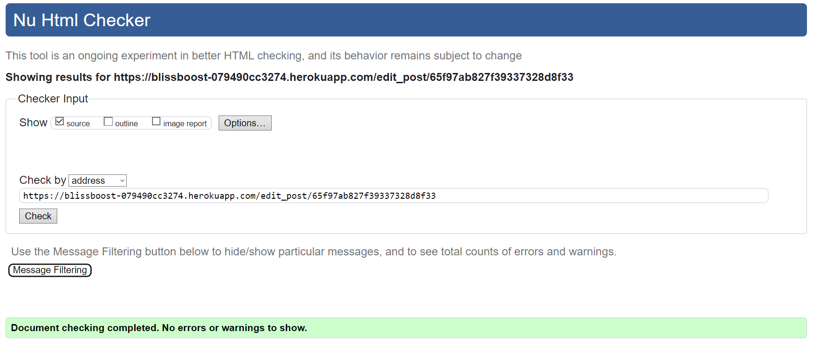
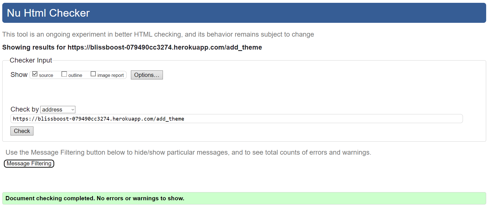
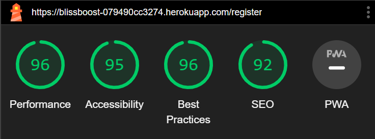
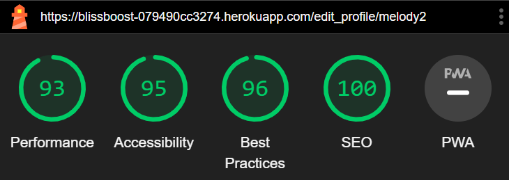

# BlissBoost Testing

[View the live project here.](https://blissboost-079490cc3274.herokuapp.com)

Manual testing was conducted continuously throughout the development process to ensure the functionality of various features across the site.

- - -

## CONTENTS

* [AUTOMATED TESTING](#automated-testing)
  * [W3C Validator](#w3c-validator)
  * [JavaScript Validator](#javascript-validation)
  * [Python Validator](#python-validation)
  * [Lighthouse](#lighthouse)
  * [WAVE Testing](#wave-testing)
* [MANUAL TESTING](#manual-testing)
  * [Testing User Stories](#testing-user-stories)
  * [Full Testing](#full-testing)
    * [Site Wide](#site-wide)
    * [Index Home](#index-home)
    * [Register Page](#register-page)
    * [Log In Page](#log-in-page)
    * [Profile](#profile)
    * [Edit Profile](#edit-profile)
    * [Community Posts](#community-posts)
    * [Add Post](#add-post)
    * [Edit Post](#edit-post)
    * [Get Themes](#get-themes)
    * [Add Theme](#add-theme)
    * [Edit Theme](#edit-theme)
    * [404 Page](#404-page)
* [BUGS](#bugs)
  * [Solved Bugs](#solved-bugs)
  * [Known Bugs](#known-bugs)

  --------

## AUTOMATED TESTING

### W3C Validator

[W3C](https://validator.w3.org/) was used to validate the HTML on all pages of the site along with validation of CSS. I have checked the HTML via url input of the deployed site, so as not to flag errors within the jinja templating, and the CSS has been tested by direct input.

Index HTML

Register HTML

Log In HTML

Profile HTML

Edit Profile HTML

Community Posts HTML

In the community posts page the validator flagged up a possible misuse of aria label in the following code snippet. After reviewing the code and conducting extra tests using samsung talkback and windows narrator I have decided to keep this code as it is.

            

                

                        Embrace serenity 🌿

                    <i class="hoverable right fa-solid fa-ellipsis-vertical">

                    </i>

                

Add Post HTML

Edit Post HTML

Manage Themes HTML

Add Theme HTML

Edit Theme HTML

CSS

>Note:
> The 404 page was also tested via manual input and returned no errors outside of the jinja templating.
>

Code input for 404 here.

>
>

### Javascript Validation

[JS Hint](https://jshint.com) has been used to test the vanilla javascript on the site. This flagged no major errors, but there were some warnings for undefined and unused variables. Both undefined variable errors are from code that has been copied from Materialize and all variables have been used within HTML files.

Vanilla Javascript

### Python Validation

[CI Python Linter](https://pep8ci.herokuapp.com) has been used to validate all python code on the site and ensure it is pep8 compliant. This has flagged no errors with the current code.

Python

### Lighthouse

The lighthouse tool within the chrome developer tools has been used to test performance, best practices, accessibility, and SEO. Desktop and mobile tests have been run for each page.

Index

| | Performance | Accessibility | Best Practice | SEO |
| :---: | :---: | :---: | :---: | :---: |
| Desktop | 99 | 100 | 96 | 100 |
| Mobile | 96 | 100 | 96 | 100 |

Register

| | Performance | Accessibility | Best Practice | SEO |
| :---: | :---: | :---: | :---: | :---: |
| Desktop | 100 | 95 | 96 | 100 |
| Mobile | 96 | 95 | 96 | 92 |

Log In

| | Performance | Accessibility | Best Practice | SEO |
| :---: | :---: | :---: | :---: | :---: |
| Desktop | 99 | 95 | 96 | 100 |
| Mobile | 97 | 95 | 96 | 100 |

Profile

| | Performance | Accessibility | Best Practice | SEO |
| :---: | :---: | :---: | :---: | :---: |
| Desktop | 94 | 100 | 74 | 90 |
| Mobile | 86 | 100 | 96 | 92 |

Edit Profile

| | Performance | Accessibility | Best Practice | SEO |
| :---: | :---: | :---: | :---: | :---: |
| Desktop | 100 | 95 | 96 | 100 |
| Mobile | 93 | 95 | 96 | 100 |

Community Posts

| | Performance | Accessibility | Best Practice | SEO |
| :---: | :---: | :---: | :---: | :---: |
| Desktop | 84 | 96 | 96 | 90 |
| Mobile | 62 | 96 | 96 | 92 |

Add Post

| | Performance | Accessibility | Best Practice | SEO |
| :---: | :---: | :---: | :---: | :---: |
| Desktop | 91 | 90 | 96 | 100 |
| Mobile | 91 | 90 | 96 | 100 |

Edit Post

| | Performance | Accessibility | Best Practice | SEO |
| :---: | :---: | :---: | :---: | :---: |
| Desktop | 90 | 90 | 96 | 90 |
| Mobile | 88 | 90 | 96 | 92 |

Manage Themes

| | Performance | Accessibility | Best Practice | SEO |
| :---: | :---: | :---: | :---: | :---: |
| Desktop | 90 | 100 | 93 | 100 |
| Mobile | 72 | 100 | 96 | 100 |

Add Theme

| | Performance | Accessibility | Best Practice | SEO |
| :---: | :---: | :---: | :---: | :---: |
| Desktop | 95 | 95 | 96 | 100 |
| Mobile | 86 | 95 | 96 | 100 |

Edit Theme

| | Performance | Accessibility | Best Practice | SEO |
| :---: | :---: | :---: | :---: | :---: |
| Desktop | 94 | 95 | 96 | 90 |
| Mobile | 70 | 95 | 96 | 92 |

404 Page

| | Performance | Accessibility | Best Practice | SEO |
| :---: | :---: | :---: | :---: | :---: |
| Desktop | 100 | 100 | 93 | 90 |
| Mobile | 88 | 100 | 93 | 92 |

> Notes for Lighthouse Testing:
>
>* Best practices has been pulled down to 96 across the site due to the site logo being in png. The logo was originally converted to webp but presented issues with rendering correctly and therefore has been left as it for the time being. Future versions of the site may either find a fix for the formatting issue, or a new logo.
>
>* Accessibility score is pulled down on all pages with forms due to poor contrast on form labels using materialize's default form styling. Further exploration with styling frameworks may be required.
>
>* Performance and best practices is pulled down on all pages with images that have been uploaded to the site via url upload. Future versions of the site look to implement image file uploads and compare performance with current results.

### WAVE Testing

Parts of the site have been tested for accessibility with [WAVE](https://wave.webaim.org), however, areas of the site that require log in details would return the log in page only. The index, register, and log in pages returned no errors, but picked up the same contrasting issues on the materialize form labels as lighthouse.

## Manual Testing

### Testing User Stories

>#### User Goals
>
>- Create an account on the site.
>- Add personal details and information onto a personal profile.
>- View and create posts on the community page.
>- Edit or delete personal posts.
>- Like posts from the community page to view on their profile.
>- Delete personal account when no longer in use.
>
>#### Site Admin Goals
>
>In addition to user goals:
>
>- Edit or delete any post from the community page.
>- Add, edit or delete post themes from the theme management page.

| Goal | Implementation | Image |
| :---: | :---: | :---: |
| Create an account on the site. | Users can create an account with the register page |  |
| Add personal details and information onto a personal profile. | Users can edit their profile from the edit profile page |  |
| View and create posts on the community page. | Users can view all posts on the community page and add their own using the FAB |  |
| Edit or delete personal posts. | Users can edit their own post from the community page |  |
| Like posts from the community page to view on their profile. | Users can like any post from the community page and view them on their profile |   |
| Delete personal account when no longer in use. | Users can delete their account from the profile page |  |
| Edit or delete any post from the community page. | Admin can edit or delete any post from the community page |  |
| Add, edit or delete post themes from the theme management page. | Admin can access the themes page in order to manage themes users can post under | 

### Full Testing

#### Site-Wide

| Feature | Expected Outcome | Testing Performed | Result | Pass/Fail |
| --- | --- | --- | --- | --- |
| Navbar Links | View Different navbar links based on logged out/logged in user/logged in admin | Viewed site based on different logged in status | Links appear based on each status | __PASS__ |
| Brand Logo | Takes you to index or profile home depending on whether you are logged in | Clicked logo | Redirected accordingly | __PASS__ |
| Footer Links | Links open in new tabs to github and linked in | Clicked links | Links open in new tabs to github and linked in | __PASS__ |

#### Index Home

| Feature | Expected Outcome | Testing Performed | Result | Pass/Fail |
| --- | --- | --- | --- | --- |
| Register Button in call to action | To be taken to the register page | Clicked button | Taken to register page | __PASS__ |
| Log in Button in call to action | To be taken to the log in page | Clicked button | Taken to log in page | __PASS__ |

#### Register Page

| Feature | Expected Outcome | Testing Performed | Result | Pass/Fail |
| --- | --- | --- | --- | --- |
| Form validation | Tooltip appears if input doesn't match the requested format | Input incorrect format | Tooltip appears and suggests longer password if too short | __PASS__ |
| Password Confirmation | Flash message if passwords do not match | input unmatched passwords | Flash message appears | __PASS__ |
| View password input | Password becomes visible | Click eye icons with password input | Passwords become visible | __PASS__ |
| Username exists | Flash message in username exists | Enter existing username | Flash message appears | __PASS__ |
| Register account | Flash message indicating success and redirect to profile | Register account | Flash message appears and redirected to profile | __PASS__ |

#### Log In Page

| Feature | Expected Outcome | Testing Performed | Result | Pass/Fail |
| --- | --- | --- | --- | --- |
| Form validation | Tooltip appears if input doesn't match the requested format | Input incorrect format | Tooltip appears and suggests longer password if too short | __PASS__ |
| View password input | Password becomes visible | Click eye icon with password input | Password become visible | __PASS__ |
| Incorrect username or password | Flash message incorrect username or password | Enter incorrect username and password | Flash message appears | __PASS__ |
| Log in | Flash message indicating success and redirect to profile | Log in correctly | Flash message appears and redirected to profile | __PASS__ |

#### Profile

| Feature | Expected Outcome | Testing Performed | Result | Pass/Fail |
| --- | --- | --- | --- | --- |
| User must exist | Flash message user not found if incorrect user and redirected home | Enter incorrect user into url | Message flashes user is directed to their profile if logged in or index if logged out | __PASS__ | 
| View Liked posts | Collapsible expands to view posts details | Click collapsible | Post details appear | __PASS__ |
| Unlike posts from collapsible | Post is removed | Click orange bin icon | Post is removed | __PASS__ |
| Only view your own profile | Flash message "you can not view this page" | Enter another user in url | Flash message appears | __PASS__ |
| Upload Photo - modal | Opens upload modal | Click FAB icon | Modal appears | __PASS__ |
| Upload Photo - cancel | Closes modal | Click cancel link | Modal closes | __PASS__ |
| Upload Photo | Photo appears on profile | Enter photo url in modal | Photo uploads | __PASS__ |
| Edit profile | Taken to edit profile page | Click FAB icon | Redirected to edit profile page | __PASS__ |
| Delete Profile -modal | Modal opens to confirm deletion | Click FAB icon | Modal opens | __PASS__ |
| Delete Profile - cancel | Closes modal and returns to profile | Click cancel link | Modal closes | __PASS__ |
| Delete profile | Deleted user from the database and returns to home | Click delete button | User is deleted and redirected home | __PASS__ |

#### Edit Profile

| Feature | Expected Outcome | Testing Performed | Result | Pass/Fail |
| --- | --- | --- | --- | --- |
| Enter details as you wish | Details updated in profile and flash message for success | Enter details in some fields | Flash message appears and details updated | __PASS__ |
| Cancel edit | Return to profile page | Click cancel link | Returned to profile | __PASS__ |
| Only edit your own profile | Flash unauthorized message and redirect to profile | Entered another username in url | Flash message appears and redirected | __PASS__ |

#### Community Posts

| Feature | Expected Outcome | Testing Performed | Result | Pass/Fail |
| --- | --- | --- | --- | --- |
| Must be logged in to view this page | Flash message log in to continue, redirect to login | Access by url entry | Flash message appears, redirected to log in | __PASS__ |
| Search Posts | Show posts based on title, theme or author | Entered various titles, themes and users into search bar | Relevant posts appear | __PASS__ |
| Clear search | Return to view all posts on page | Clicked clear search button | All posts return | __PASS__ |
| View post description | Show post description on click | Click card action or theme image | Post description appears | __PASS__ |
| Like post | Heart icon changes and add one to like count | Click heart icon | Icon and like count change | __PASS__ |
| Add post | Directs to add post page | Click FAB icon | Derected to add post page | __PASS__ |
| Edit post | Icon appears only on users' own posts (Admin can edit all posts), directs to edit post page | Click edit icon | Directed to edit post page | __PASS__ |

#### Add Post

| Feature | Expected Outcome | Testing Performed | Result | Pass/Fail |
| --- | --- | --- | --- | --- |
| Must be logged in to view this page | Flash message log in to continue, redirect to login | Access by url entry | Flash message appears, redirected to log in | __PASS__ |
| Form Validation | Tooltip appears to inform you to input into all fields | Tried posting with empty fields | Tooltip appears | __PASS__ |
| Cancel add post | Return to community page | Click cancel link | Returned to posts page | __PASS__ |
| Add Post | Post added to community page with flash message | Input correctly and click add post button | Post added and flash message appears | __PASS__ |

#### Edit Post

| Feature | Expected Outcome | Testing Performed | Result | Pass/Fail |
| --- | --- | --- | --- | --- |
| Must be logged in to view this page | Flash message log in to continue, redirect to login | Access by url entry | Flash message appears, redirected to log in | __PASS__ |
| Must be the author to edit post | Flash unauthorized message, redirect to community page | Access by url entry | Message flashed and redirected | __PASS__ |
| Form Validation | Tooltip appears to inform you to input into all fields | Tried updating with empty fields | Tooltip appears | __PASS__ |
| Cancel Edit post | Return to community page | Click cancel link | Returned to posts page | __PASS__ |
| Edit Post | Post updated to community page with flash message | Input correctly and click add post button | Post updated and flash message appears | __PASS__ |
| Edit Any Post - Admin | Post updated to community page with flash message | Input correctly and click add post button | Post updated and flash message appears | __PASS__ |
| Delete Post - modal | Modal opens for confirmation | Click delete link | Modal opens | __PASS__ |
| Delete Post - cancel | Modal closes without deletion | Click cancel link | Modal closes | __PASS__ |
| Delete Post | Post deleted from database and no longer appears in community page | Click delete button | Post is deleted and does not appear | __PASS__ |

#### Get Themes

| Feature | Expected Outcome | Testing Performed | Result | Pass/Fail |
| --- | --- | --- | --- | --- |
| Must be logged in to view this page | Flash message log in to continue, redirect to login | Access by url entry | Flash message appears, redirected to log in | __PASS__ |
| Must be Admin to view this page | Flash unauthorized message, redirect to profile page | Access by url entry | Message flashed and redirected | __PASS__ |
| Add Theme | Directed to add theme page | Click add theme button | Directed to add theme page | __PASS__ |
| Edit Theme | Directed to edit theme page | Click edit theme button | Directed to edit theme page | __PASS__ |

#### Add Theme

| Feature | Expected Outcome | Testing Performed | Result | Pass/Fail |
| --- | --- | --- | --- | --- |
| Must be logged in to view this page | Flash message log in to continue, redirect to login | Access by url entry | Flash message appears, redirected to log in | __PASS__ |
| Must be Admin to view this page | Flash unauthorized message, redirect to profile page | Access by url entry | Message flashed and redirected | __PASS__ |
| Form Validation | Tooltip appears to inform you to input into all fields | Tried updating with empty fields | Tooltip appears | __PASS__ |
| Cancel Add Theme | Return to themes page | Click cancel link | Returned to themes page | __PASS__ |
| Add Theme | Theme added to themes page with flash message | Input correctly and click add post button | Theme updated and flash message appears | __PASS__ |

#### Edit Theme

| Feature | Expected Outcome | Testing Performed | Result | Pass/Fail |
| --- | --- | --- | --- | --- |
| Must be logged in to view this page | Flash message log in to continue, redirect to login | Access by url entry | Flash message appears, redirected to log in | __PASS__ |
| Must be Admin to view this page | Flash unauthorized message, redirect to profile page | Access by url entry | Message flashed and redirected | __PASS__ |
| Form Validation | Tooltip appears to inform you to input into all fields | Tried updating with empty fields | Tooltip appears | __PASS__ |
| Cancel Edit Theme | Return to themes page | Click cancel link | Returned to themes page | __PASS__ |
| Edit Theme | Theme updated to themes page with flash message | Input correctly and click add post button | Theme updated and flash message appears | __PASS__ |
| Delete Theme - modal | Modal appears for confirmation | Click delete link | Modal appears | __PASS__ |
| Delete Theme - cancel | Modal closes without deletion | Click cancel link | Modal closes | __PASS__ |
| Delete Theme | Theme is deleted from the database and no longer appears on theme page | Click delete button | Theme is deleted and no longer appears | __PASS__ |

#### 404 Page

| Feature | Expected Outcome | Testing Performed | Result | Pass/Fail |
| --- | --- | --- | --- | --- |
| Appears when incorrect url entered | View 404 page | Input incorrect url path | Page appears | __PASS__ |
| Home button | User is returned to index if logged out or their profile if logged in | Click Home button | Redirected accordingly | __PASS__ |

### Accessibility Testing

Accessibility has been tested via narrator for windows and talkback on android. This has highlighted issues with focusing on the floating action button on mobile. Alternative hidden nav links have been added to the navbar for editing profile and adding posts to enable talkback users to access the site fully without impacting the original styling of the site until a solution can be found.